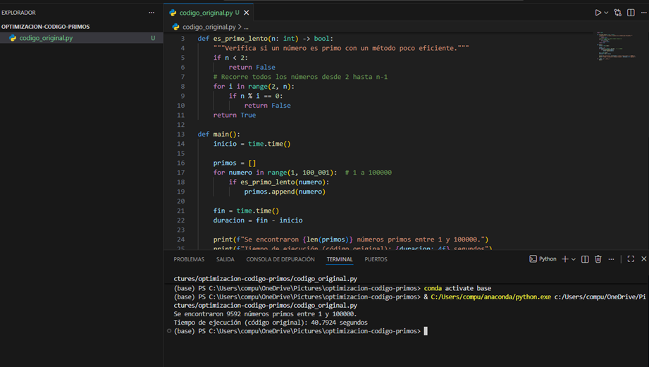
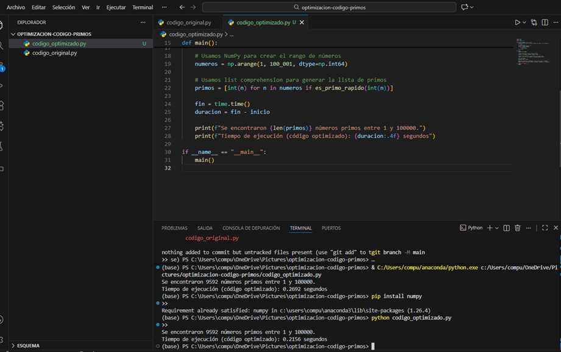
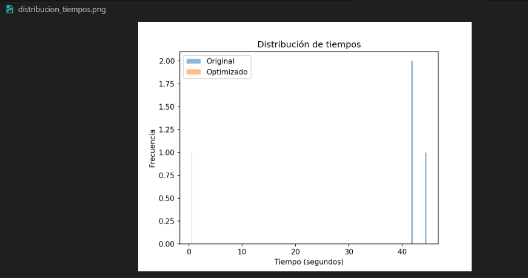
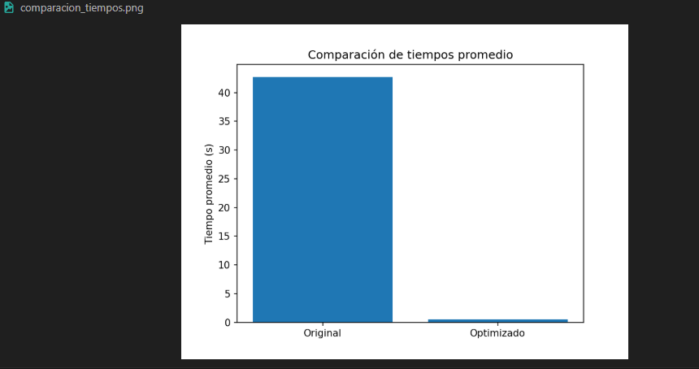

 Optimización de Código y Medición de Tiempos  
**Nombre:** Victoria Moyon
**Asignatura:** Cultura Digital  
**Unidad 2 – Tema 2**  
**Carrera:** Ciencia de Datos e Inteligencia Artificial  
**Semestre:** Tercero  
**Fecha:** 21-11-2025  

---

1. Introducción

El objetivo de esta actividad es aplicar técnicas de optimización y buenas prácticas de programación 
para mejorar la eficiencia de un algoritmo en Python que identifica números primos dentro del 
rango de 1 a 100 000.  

El código original utiliza un método poco eficiente:  
- Recorre todos los números desde 2 hasta n-1  
- No utiliza atajos matemáticos  
- No aprovecha librerías optimizadas  

Este enfoque provoca tiempos de ejecución altos y un uso innecesario de recursos.

A continuación se presenta el código original utilizado, junto con su tiempo de ejecución.

**Captura del código original y su ejecución:**  

---

2. Optimización del Código

###  1. Iterar solo hasta la raíz cuadrada  
Reduce drásticamente el número de divisiones necesarias.

###  2. Uso de *list comprehensions*  
Permiten generar listas de forma más eficiente y legible.

###  3. Uso de NumPy  
Se utiliza `np.arange` para generar el rango de valores como un arreglo optimizado.
  

 3. Resultados y Análisis

Los tiempos de ejecución promedio fueron:

| Versión | Tiempo promedio |
|--------|------------------|
| Código original | **~42.41 segundos** |
| Código optimizado | **~0.88 segundos** |

Esto representa una mejora de aproximadamente:

**Un 98% de reducción en tiempo de ejecución**  
*(El código optimizado es 40–80 veces más rápido según las mediciones.)*

---

 3.1 Análisis usando cProfile  

Se generaron los archivos:

- `profiling_original.prof` → `profiling_original.txt`  
- `profiling_optimizado.prof` → `profiling_optimizado.txt`

### Resultados principales:

#### Código original:
- La función `es_primo_lento` consume casi todo el tiempo.
- Esto se debe a que realiza muchísimas divisiones.

#### Código optimizado:
- La función `es_primo_rapido` tiene un tiempo mucho menor gracias a:
  - Iterar solo hasta √n  
  - Menor número de operaciones  
  - Uso de NumPy
  

3.2 Gráficas con Matplotlib  

###  Distribución de tiempos de ejecución  

###  Comparación de tiempos promedio  

Estas gráficas muestran de manera visual el impacto que tuvo la optimización.

---

 4. Conclusiones

- La optimización aplicada reduce el tiempo de ejecución de más de **40 segundos** a menos de **1 segundo**.
- El uso de **raíces cuadradas**, **list comprehensions** y **NumPy** tiene un impacto significativo en el rendimiento.
- La herramienta **cProfile** permite detectar qué funciones consumen más tiempo.
- Las gráficas ayudan a visualizar la mejora lograda y respaldan el análisis.
- Este proceso demuestra la importancia de escribir el código.

---

 5. Enlace al repositorio GitHub

**Repositorio del proyecto:**  
https://github.com/VictoriaNayely211/optimizacion-codigo-primos

---
